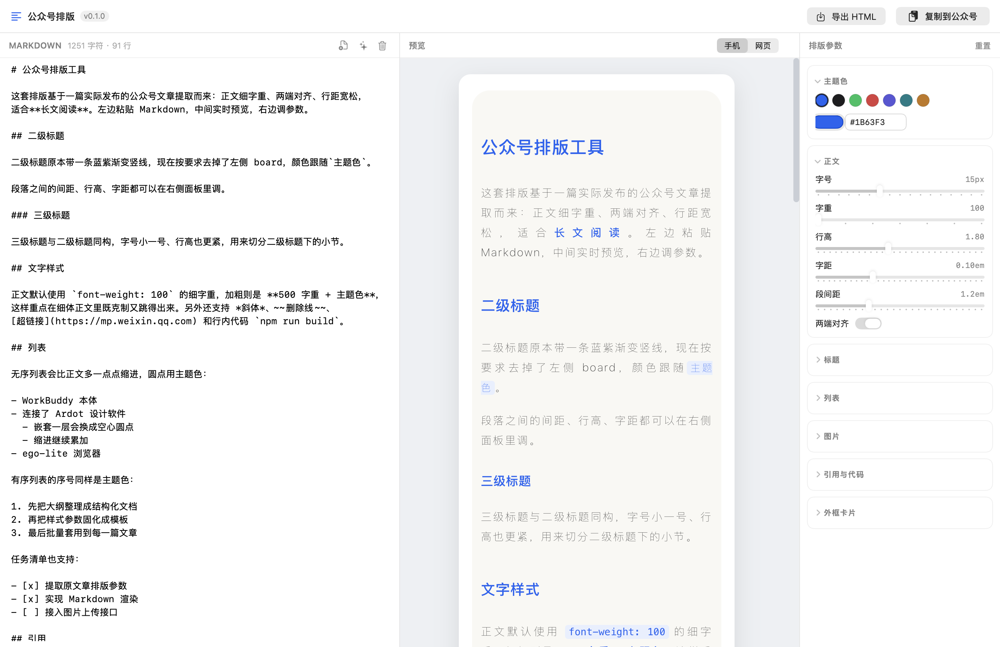

# 公众号排版工具 (MPStyle)

[](https://github.com/comeonzhj/mp-style/actions/workflows/ci.yml)
[](https://github.com/comeonzhj/mp-style/releases/latest)
[](LICENSE)

把 Markdown 一键转成可直接粘贴进微信公众号编辑器的富文本。

原生 SwiftUI 单窗口应用，**没有 Electron、没有运行时依赖**。通用二进制（Apple Silicon + Intel），
bundle 约 2MB。



## 下载安装

到 [Releases](https://github.com/comeonzhj/mp-style/releases/latest) 下载 `MPStyle-x.y.z.dmg`，
双击挂载后把图标拖进「应用程序」即可。

已用 Developer ID 签名并通过 Apple 公证，**双击直接打开**，不需要右键绕过 Gatekeeper，
断网首次启动也不会被拦。要求 macOS 13 或更新版本。

排版基准取自一篇实际发布的公众号文章，并按需求做了定制改造，
详见 [`docs/baseline-style.md`](docs/baseline-style.md)。

---

## 快速开始

```bash
make run          # 编译并启动
```

首次运行会载入一篇示例文档，把 Markdown 粘到左边就能看到右边实时排版。

- `⇧⌘C` 复制为公众号格式
- `⌘O` 打开 `.md` 文件
- `⇧⌘E` 导出 HTML

## 用法

1. 左侧粘贴 Markdown（或 `⌘O` 打开文件）
2. 右侧调排版参数
3. 二选一：
   - `⇧⌘C` 复制，到公众号编辑器 `⌘V` 粘贴
   - `⇧⌘P` 直接发布到公众号草稿箱

## 发布到草稿箱

工具栏「发布到草稿箱」打开配置面板，填好 AppID / AppSecret 就能一键写入草稿箱，
到公众号后台的草稿箱里确认排版后再决定是否群发。

**AppSecret 存在系统钥匙串**，不会被写进任何配置文件。

### 发布前要准备两件事

**1. 拿到 AppID 与 AppSecret**
「公众号后台 → 设置与开发 → 基本配置」，AppSecret 只在生成时显示一次，忘了就重置。

**2. 把本机公网 IP 加进白名单**
同一页往下有「IP 白名单」。不加的话接口一律返回 40164 拒绝调用。
面板里的「测试连接」会立刻告诉你 IP 对不对，报错信息里直接带上当前公网 IP。
动态 IP 每次变更都要重新添加。

> 草稿箱接口需要**已认证**的公众号。未认证的订阅号会返回 48001，
> 没有这个权限，只能用复制粘贴那条路。

### 图片会自动搬到公众号图床

公众号对外站图片有防盗链，直接引用外链的草稿发布后图片会变成裂图。
勾选「把正文里的外链图片上传到公众号」后，程序会下载每张图、
上传到公众号图床、替换地址。单张失败不会中断整篇，会在日志里标出来。

### 命令行验证

不想开界面时可以直接跑：

```bash
make publish-check          # 用 .env 里的凭据打一篇测试草稿
```

凭据放工作区根目录的 `.env`：

```
AppID=wx1234567890abcdef
AppSecret=0123456789abcdef0123456789abcdef
```

该文件已在 `.gitignore` 里排除。引号可有可无，单双引号都会正确处理。

## 排版规则

| 元素 | 规则 |
|---|---|
| 正文 | `font-weight: 100` 细体，行高 1.8，字距 0.1em，`#333333`，两端对齐 |
| 加粗 | 字重与颜色都可配。默认 `font-weight: 500` + 主题色，也可设为「同正文」只加粗不变色 |
| 二级标题 | 移除原样式的左侧渐变竖条，颜色改为主题色（默认 `#1B63F3`） |
| 三级标题 | 新增。与二级同构，字号更小、行高更紧 |
| 有序/无序列表 | 相对正文增加缩进，序号与圆点用主题色，悬挂缩进保证折行对齐 |
| 图片 | 统一圆角 + `0 8px 25px rgba(0,0,0,.1)` 柔和阴影 |
| 引用 | 主题色左边线 + 极浅主题色底 + 右侧圆角 |
| 代码块 | 浅灰底 + 8px 圆角 + 等宽字体，自动折行不溢出 |
| 行内代码 | 主题色浅底 + 主题色文字 |

所有元素都能在右侧面板里调（字号、字重、行高、字距、段间距、主题色、圆角……），
参数自动存到 UserDefaults，下次打开还在。

## 定制滚动块

三种容器标签，用来把「读者需要但会打断阅读节奏」的内容折叠起来。

### `<long-text>` 长文本块

大段文字放进限高容器，超出部分在容器内上下滚动。

```
<long-text>
这里是塞进滚动块里的一大段文字，段落、**加粗**、`行内代码` 都能正常渲染。

第二段。内容超过限高后容器内部出现滚动条。
</long-text>
```

内容比限高短时容器按内容高度自适应，**不会**出现滚动条（用的是 `max-height` 不是 `height`）。
如果需要滚动块能容纳更长的内容，可以在右侧「滚动块」里调大限高。

### `<long-image>` 长图

长截图、长表格、信息图限高后内部上下滚动，默认限高 450px。

```
<long-image>

</long-image>
```

### `<more-images>` 多图横滑

多张图排成一条水平线左右滑动。单张图默认占容器宽度 72%，
所以下一张会露出一角，天然形成「可以往右滑」的提示。

```
<more-images>


</more-images>
```

### 写法说明

- **多行写法**：起止标签各占一行（上面的例子）
- **单行写法**：`<long-text>内容直接写在中间</long-text>`
- 标签名大小写不敏感
- 没写结束标签时会一直读到文件结尾，不会丢内容
- 图片支持三种写法：``、``、一行一个裸 URL
- 滚动块下方默认显示「↓ 上下滑动查看」/「左右滑动查看更多 →」，可在面板关闭

### 为什么公众号里能滚动

容器用的是内联的 `overflow-y: auto`（横滑用 `overflow-x: auto`）+ `max-height`，
并开启 `-webkit-overflow-scrolling: touch` 让 iOS 上是原生顺滑滚动而不是逐帧重绘。
参考文章的原始排版里就有这种写法，公众号编辑器会保留这些内联声明。

## 支持的 Markdown 语法

ATX 标题 `#`~`######`、段落、软换行（中文自动不补空格）、硬换行（行尾两空格或 `\`）、
**加粗**、*斜体*、***粗斜体***、~~删除线~~、`行内代码`、围栏代码块、
有序/无序/嵌套/任务列表、引用（可嵌套）、GFM 表格、图片、链接、裸链接、自动链接、分割线、反斜杠转义，
以及上面三种定制滚动块标签。

## 为什么能粘进公众号

公众号编辑器会**丢弃 `<style>` 标签和 class**，只保留内联样式。所以渲染器：

- 所有样式内联在 `style` 属性里，不含任何 `<style>` / `class`
- 列表序号、任务勾选框是**真实文本节点**（公众号不支持 `::before` / `list-style` 颜色）
- 剪贴板同时写入 `public.html` 和 `public.utf8-plain-text`（后者作为降级回退）
- 预览用的是**和剪贴板完全相同的那份 HTML**，所见即所得

> ⚠️ 一个容易踩的坑：`style` 属性用双引号包裹，所以样式值里不能出现双引号，
> 否则属性会被浏览器提前截断、后面的声明全部失效。
> 字体名一律用单引号，`StyleKit.css()` 里也有兜底替换。`make test` 会校验这一点。

## 配套 Agent Skill

同一套排版能力也封装成了两个独立的 Agent Skill，**不依赖这个 App**，
放在 `~/.workbuddy/skills/` 下，装了 Python 3 就能跑：

| Skill | 作用 |
|---|---|
| `mp-wechat-style` | Markdown 排版 → 预览 / 复制 / 发布草稿箱。含 Python 版渲染器、主题系统 |
| `mp-wechat-extract` | 给一篇公众号文章链接，还原它的排版成主题 JSON，可直接给上面那个用 |

两个 Skill 与这个 App **共用同一套主题规格**（字段名与 `ThemeConfig` 一致），
所以 App 里的排版参数、Skill 里生成的主题、从别人文章萃取的风格，三者可以互相流转。

Python 版渲染器与这个 App 的输出做过逐条比对：内联样式 55 条完全一致，
正文文本逐字一致。

## 项目结构

```
Sources/
├── MPStyleApp.swift          App 入口、菜单、窗口
├── BuildInfo.swift           构建时生成（版本号 / 构建时间 / git hash）
├── Model/
│   ├── ThemeConfig.swift     全部排版参数 + 持久化 + 主题色预设
│   └── SampleDocument.swift  首次打开的示例文档
├── Markdown/                 解析层（有状态、纯逻辑，无 UI 依赖）
│   ├── MDNode.swift          块级 / 行内 AST
│   ├── RegexKit.swift        正则缓存与匹配工具
│   ├── BlockParser.swift     块级解析
│   └── InlineParser.swift    行内解析
├── Net/
│   └── WeChatClient.swift    公众号开放接口（token / 传图 / 草稿）
├── Render/                   渲染层（无 UI 依赖，命令行可直接复用）
│   ├── HexColor.swift        颜色混合 / 淡化 / rgba
│   ├── StyleKit.swift        ThemeConfig → CSS 声明
│   ├── HTMLRenderer.swift    AST → 内联样式 HTML
│   └── PlainTextRenderer.swift 纯文本降级输出
└── UI/                       界面层
    ├── AppState.swift        状态与动作
    ├── AppState+Publish.swift 发布到草稿箱的流水线
    ├── PublishSheet.swift    发布配置面板
    ├── RootView.swift        根布局
    ├── EditorPane.swift      左：Markdown 编辑
    ├── PreviewPane.swift     中：WKWebView 预览
    ├── InspectorPane.swift   右：参数面板
    ├── Components.swift      通用组件
    └── ClipboardExporter.swift 剪贴板导出

Tests/
├── main.swift                渲染 CLI + 规则断言（make test）
├── sample.md                 校验用样例
├── ui-snapshot/              界面快照工具（make snapshot）
├── hardened-check/           强化运行时 + WKWebView JS 自检（make hardened-check）
├── publish-check/            草稿箱连通性验证（make publish-check）
└── clipboard-check/          剪贴板验证工具（make copy-check）

scripts/
├── gen-buildinfo.sh              版本号注入
├── make-icon.py                  生成 AppIcon.icns
├── make-dmg.py                   生成带拖拽引导的 DMG
└── store-notary-credentials.sh   交互式存入公证凭据
```

**分层原则**：`Markdown` / `Render` / `Model` 三层不依赖任何 UI 框架，
所以能被命令行工具直接编译复用 —— 排版逻辑可以脱离 GUI 测试。

## 构建

```bash
make build        # 编译出 build/MPStyle.app（通用二进制，自动用 Developer ID 签名）
make run          # 编译并启动
make test         # 渲染校验 + 规则断言
make snapshot     # 离屏渲染界面 PNG 到 Tests/out/ui.png
make hardened-check  # 验证强化运行时下 WKWebView 的 JS 仍能执行
make copy-check   # 把渲染结果写进剪贴板，验证 public.html
make icon         # 重新生成图标（需要 Pillow）
make doctor       # 自检证书 / Team ID / 公证凭据是否就绪
make install      # 安装到 /Applications
make clean        # 清理
make info         # 查看版本 / 架构 / 源码规模
```

默认编出 `arm64 + x86_64` 通用二进制。只想要单架构可以 `make build ARCHS=arm64`，编译时间大约减半。

### 可选依赖

只有两件事需要额外装包，缺了也不影响主流程：

| 用途 | 依赖 | 缺失时的行为 |
|---|---|---|
| 生成 DMG 背景与图标布局 | `pip install dmgbuild Pillow` | 退回朴素 DMG（无引导界面） |
| 生成应用图标 | `pip install Pillow` | 沿用已提交的 `Resources/AppIcon.icns` |

## 签名、公证与分发

产出的 `.app` / `.dmg` 已用 Developer ID 签名并通过 Apple 公证，
**别人下载后双击即可打开**，不会有「已损坏，无法打开」或「来自身份不明的开发者」提示。

### 一次性配置

```bash
make doctor          # 先看证书和凭据状态
make credentials     # 交互式输入 Apple ID + App 专用密码，存进钥匙串
```

`make credentials` 走 `read -s` 交互输入，密码不会出现在命令行参数里
（否则会泄漏到 `ps` 输出和 shell 历史）。
App 专用密码在 [account.apple.com](https://account.apple.com) → 登录与安全 → App 专用密码 生成，
**不是**账号登录密码。

> **无 GUI 的环境（CI、受限 shell）** 写钥匙串会报
> `An error occurred while accessing the keychain. User interaction is not allowed.`
> 此时改用命令行直传凭据，完全绕开钥匙串：
>
> ```bash
> make release APPLE_ID=you@example.com APP_PASSWORD=xxxx-xxxx-xxxx-xxxx
> ```

### 发布

```bash
make release
```

七步全自动：

```
1/7 强化运行时自检        ← 确认签名后 WKWebView 的 JS 没被 JIT 限制拦掉
2/7 构建 + Developer ID 签名（--options runtime --timestamp）
3/7 提交 Apple 公证 .app
4/7 装订公证票据到 .app
5/7 生成 DMG 并签名
6/7 提交 Apple 公证 DMG + 装订
7/7 Gatekeeper 评估
```

产出：

| 文件 | 说明 |
|---|---|
| `build/MPStyle-<版本>.dmg` | 推荐分发。带拖拽安装引导界面 |
| `build/MPStyle.app` | 已公证并装订，可直接压缩分发 |

DMG 的引导界面（窗口尺寸、图标坐标、背景图）由 `scripts/make-dmg.py` 通过
`dmgbuild` 直接写 `.DS_Store` 生成，**不经过 AppleScript 驱动 Finder** ——
后者需要「自动化」权限，在无 GUI 授权或 CI 环境下会直接报 `-10004 权限违例`。

单独重跑某一步：`make notarize` / `make notarize-dmg` / `make staple` / `make dmg`。

### 几个必须记住的点

**顺序不能乱：建 DMG → 签名 → 公证 → 装订。**
`codesign` 会重写文件、清掉已装订的票据；公证后再重新编译同样会让 cdhash 变化、
票据失效。所以 `dmg` 目标刻意**不依赖 `build`**，打包的永远是当前那份已装订的产物。

**DMG 必须单独签名。** 公证 ≠ 签名。只公证不签名的 DMG 会被 `spctl` 判为
`no usable signature`，必须额外 `codesign --sign` 一次。

**公证 DMG 前必须确认文件没被占用。** Apple 的预检要完整读一遍文件，
一旦有残留挂载卷或 `diskimage` 进程持有它，`notarytool` 会卡在
`initiating connection to the Apple notary service` 且**永远不返回、也不报错**。
`make notarize-dmg` 内置了 `lsof` 守护，遇到占用会直接报错退出。
真遇到了就 `diskutil unmount` 卸载残留卷，或 `kill` 掉 `diskimage` 进程。

**装订（staple）决定离线可用性。** 票据烙进产物后，用户断网首次打开也不会被
Gatekeeper 拦。只公证不装订的话，首次启动需要联网向 Apple 查询。

**不需要任何 entitlements。** 应用非沙盒，预览用的 WKWebView 在强化运行时下
JavaScript 执行正常（`make hardened-check` 会验证这条链路）。加
`com.apple.security.cs.allow-jit` 之类的授权反而会放宽安全边界。

**没有 Developer ID 证书的机器上**，`make build` 会自动退回 ad-hoc 签名，
本地开发照常；`make release` 会明确报错退出，不会产出假装能分发的包。

### 两个构建环境相关的坑

1. **`-disable-sandbox` 不能省。** Swift 6 会用受限沙箱启动宏插件服务进程
   (`swift-plugin-server`)，在受限环境里 `sandbox_apply` 会失败，
   报 `SwiftUIMacros.StateMacro ... produced malformed response`。关掉子进程沙箱即可。
2. **Xcode 许可协议。** 若 `swiftc` 报 "You have not agreed to the Xcode license agreements"，
   需要先执行 `sudo xcodebuild -license accept`，或改用 `/Library/Developer/CommandLineTools`。

## 版本管理

版本号写在 [`VERSION`](VERSION)，构建时由 `scripts/gen-buildinfo.sh` 注入到
`Sources/BuildInfo.swift`（含 git short hash，工作区脏时带 `-dirty`）。
变更记录见 [`CHANGELOG.md`](CHANGELOG.md)。

## 后续可迭代方向

- 图片本地化 / 上传到公众号素材库
- 主题方案保存与切换（当前只有主题色预设）
- 代码块语法高亮（需转成内联 span，注意公众号样式限制）
- 自定义 CSS 注入
- 多套排版模板管理

## 许可

[MIT](LICENSE)
